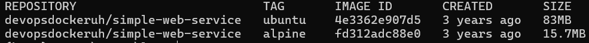

# DevOps with Docker

## Exercise 1.1: Getting started

**output**


## Exercise 1.2: Hello, Docker Hub

**output**


## Exercise 1.3: Secret message

**output**


## Exercise 1.4: Missing dependencies

**output**  
smart solution:


```markdown
docker run -it -e WEBSITE=helsinki.fi ubuntu /bin/bash -c 'apt-get update && apt-get install curl -y && echo "Searching.." && sleep 1 && curl http://$WEBSITE'
```

output:  
.png>)

## Exercise 1.5: Sizes of images

**output**  
download images:

```markdown
docker pull devopsdockeruh/simple-web-service:ubuntu
docker pull devopsdockeruh/simple-web-service:alpine
```

compare sizes:

```markdown
docker image ls
```

output:

¨
running the alpine image and finding the secret message:

```markdown
docker run -d --name alpine-test devopsdockeruh/simple-web-service:alpine  
docker exec —it alpine—test sh  
tail -f ./text.log
```

output:
.png>)
