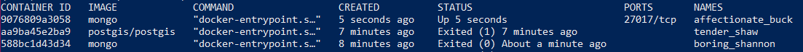
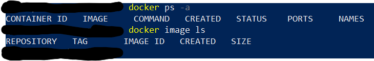
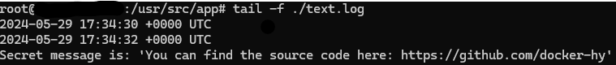
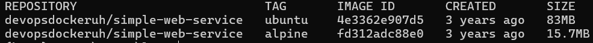
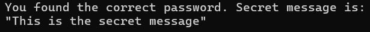

# DevOps with Docker

## Exercise 1.1: Getting started

**output**



## Exercise 1.2: Hello, Docker Hub

**output**



## Exercise 1.3: Secret message

**output**



## Exercise 1.4: Missing dependencies

**output**  
smart solution:


```markdown
docker run -it -e WEBSITE=helsinki.fi ubuntu /bin/bash -c 'apt-get update && apt-get install curl -y && echo "Searching.." && sleep 1 && curl http://$WEBSITE'
```

output:  
.png>)

## Exercise 1.5: Sizes of images

**output**  
download images:

```markdown
docker pull devopsdockeruh/simple-web-service:ubuntu
docker pull devopsdockeruh/simple-web-service:alpine
```

compare sizes:

```markdown
docker image ls
```

output:

¨
running the alpine image and finding the secret message:

```markdown
docker run -d --name alpine-test devopsdockeruh/simple-web-service:alpine  
docker exec —it alpine—test sh  
tail -f ./text.log
```

output:
.png>)

## Exercise 1.6: Hello Docker Hub

**output**



## Exercise 1.7: Image for script

**output**

Dockerfile:

```markdown
FROM ubuntu:22.04

# Install curl
RUN apt-get update && \
    apt-get install -y curl && \
    rm -rf /var/lib/apt/lists/*

# Add the script file to the container
COPY script.sh /script.sh

# Give execution rights on the script
RUN chmod +x /script.sh

# Command to run on container start
CMD ["/script.sh"]
```

## Exercise 1.8: Two line Dockerfile

**output**

Dockerfile:

```markdown
FROM devopsdockeruh/simple-web-service:alpine

# Set default argument to the ENTRYPOINT
CMD ["server"]
```
command running the container:

```markdown
docker run web-server
```

## Exercise 1.9: Volumes

**output**

Command:

```markdown
touch text.log  && docker run -v "$(pwd)/text.log:/usr/src/app/text.log" devopsdockeruh/simple-web-service
```

## Exercise 1.10: Ports open

**output**

Command:

```markdown
docker run -p 127.0.0.1:8080:8080 devopsdockeruh/simple-web-service
```

## Exercise 1.11: Spring

**output**

Dockerfile:

```markdown
# Use Amazon Corretto for Java support
FROM amazoncorretto:21.0.3-al2023-headless

# Install Maven
RUN yum install -y maven

# Create app directory in container
WORKDIR /app

# Copy the project files into the container
COPY . .

# Build the application using Maven
RUN mvn clean install

# Expose the port the app runs on
EXPOSE 8080

# Run the application
CMD ["java", "-jar", "target/my-spring-app-0.0.1-SNAPSHOT.jar"]
```

## Exercise 1.12: Hello, frontend!

**output**

Dockerfile:

```markdown
FROM node:16-alpine

EXPOSE 5000

WORKDIR /usr/src/app

COPY . .

RUN npm install

RUN npm run build

RUN npm install -g serve

CMD ["serve", "-s", "-l", "5000", "build"]
```
