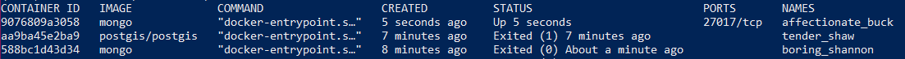
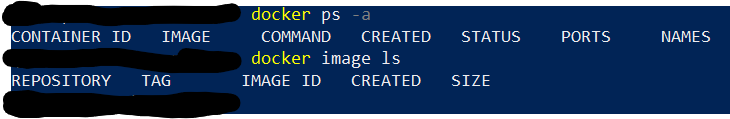
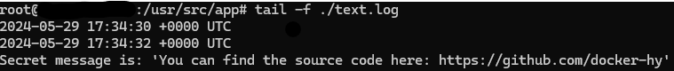
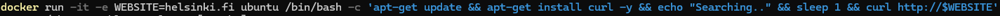

# DevOps with Docker

## Exercise 1.1: Getting started

**output**



## Exercise 1.2: Hello, Docker Hub

**output**



## Exercise 1.3: Secret message

**output**



## Exercise 1.4: Missing dependencies

**output**  
smart solution:


```markdown
docker run -it -e WEBSITE=helsinki.fi ubuntu /bin/bash -c 'apt-get update && apt-get install curl -y && echo "Searching.." && sleep 1 && curl http://$WEBSITE'
```

output:  
.png>)
